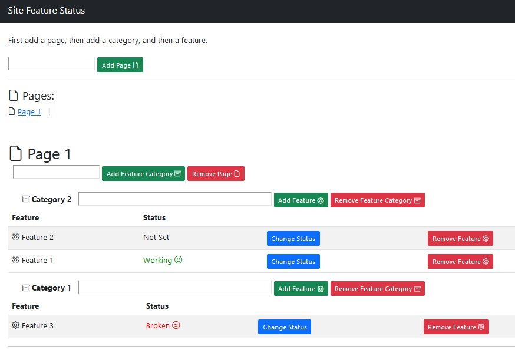

# status-tracker
A basic HTML/JQuery/PHP page feature status tracker - broken/working\
Just add the directory to a server and make sure the php file has write privileges in the dir.\
You could swap out the PHP API file for one in your langage of choice pretty easily.

